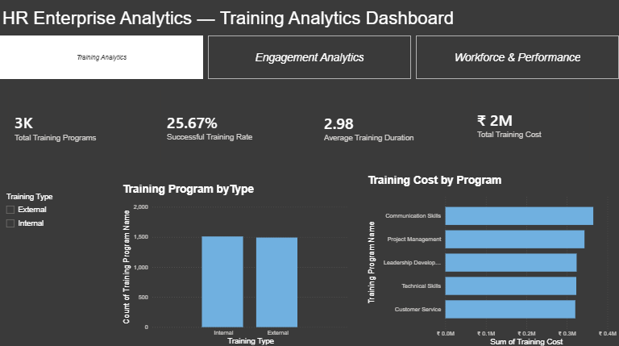
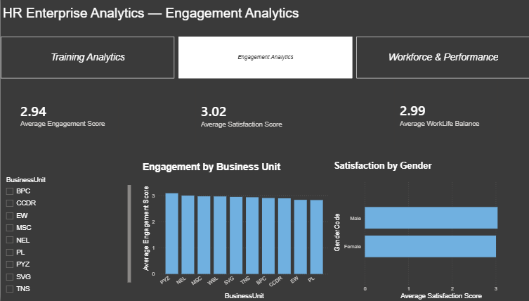
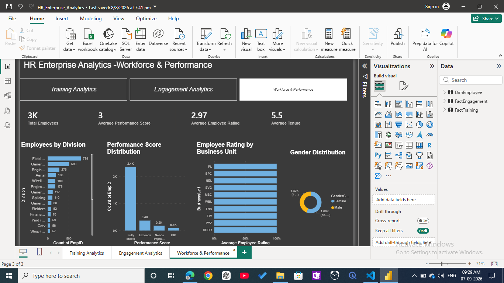

# HR Enterprise Analytics Dashboard

## 📌 Project Overview

This project is an **Enterprise HR Analytics Dashboard** built in **Power BI** using a **star-schema data model**. It provides insights into **employee training, engagement, workforce performance, and HR operations**.

The dashboard supports **HR managers and business leaders** in monitoring employee performance, training effectiveness, engagement levels, and workforce distribution.

---

## 🛠️ Tools & Technologies

* **Power BI Desktop**
* **Power Query**
* **DAX (Data Analysis Expressions)**
* **Star Schema Data Modeling**
* **Interactive Visualizations**

---

## 📂 Data Model

### Dimension Table

#### DimEmployee

* Employee details
* Department and division
* Business unit
* Gender and demographic information
* Performance and employee rating data

### Fact Tables

#### FactTraining

* Training programs
* Training duration
* Training outcome
* Training cost

#### FactEngagement

* Engagement survey data
* Satisfaction scores
* Work-life balance scores

---

## 📊 Dashboard Pages

### 1️⃣ Training Analytics

**Insights Included**

* Total training programs
* Successful training rate
* Average training duration
* Total training cost
* Training programs by type
* Training cost by program
* Interactive training type slicer

### 2️⃣ Engagement Analytics

**Insights Included**

* Average engagement score
* Average satisfaction score
* Average work-life balance score
* Engagement by business unit
* Satisfaction by gender
* Business unit slicer for interactive filtering

### 3️⃣ Workforce & Performance

**Insights Included**

* Total employees
* Average performance score
* Average employee rating
* Average tenure
* Employees by division
* Performance score distribution
* Employee rating by business unit
* Gender distribution

---

## 📈 Key Features

* ✅ Multi-page interactive dashboard
* ✅ Dynamic KPI cards
* ✅ Cross-table analysis using relationships
* ✅ DAX measures for HR metrics
* ✅ Interactive slicers and filters
* ✅ Professional dark-theme UI
* ✅ Business-focused visual storytelling

---

## 📌 Example DAX Measures

```DAX
Total Employees =
DISTINCTCOUNT(DimEmployee[EmpID])

Average Engagement Score =
AVERAGE(FactEngagement[Engagement Score])

Average Satisfaction Score =
AVERAGE(FactEngagement[Satisfaction Score])

Average Work-Life Balance =
AVERAGE(FactEngagement[Work-Life Balance Score])
```

---

## 🚀 Business Value

This dashboard helps organizations:

* Monitor **employee engagement**
* Evaluate **training effectiveness**
* Identify **high-performing business units**
* Analyze **workforce distribution**
* Support **HR decision-making with data-driven insights**

---

## 📷 Dashboard Preview

### Training Analytics



### Engagement Analytics



### Workforce & Performance



---

## 👩‍💻 Author

**Mahak Chauhan**

Aspiring **Data Analyst | Power BI | Python | SQL**
